# 🚛 Logistic Shipment Tracker - Project Flow Chart & Architecture

This document provides comprehensive visual flowcharts and architectural diagrams of the Logistic Shipment Tracker system, showing how all components interact and work together.

## Table of Contents
1. [System Overview](#system-overview)
2. [User Journey Flows](#user-journey-flows)
3. [Smart Driver Assignment Algorithm](#smart-driver-assignment-algorithm)
4. [Shipment Lifecycle Flow](#shipment-lifecycle-flow)
5. [Authentication & Authorization Flow](#authentication--authorization-flow)
6. [API Request Flow](#api-request-flow)
7. [Database Transaction Flow](#database-transaction-flow)
8. [Notification System Flow](#notification-system-flow)
9. [System Architecture](#system-architecture)

---

## System Overview

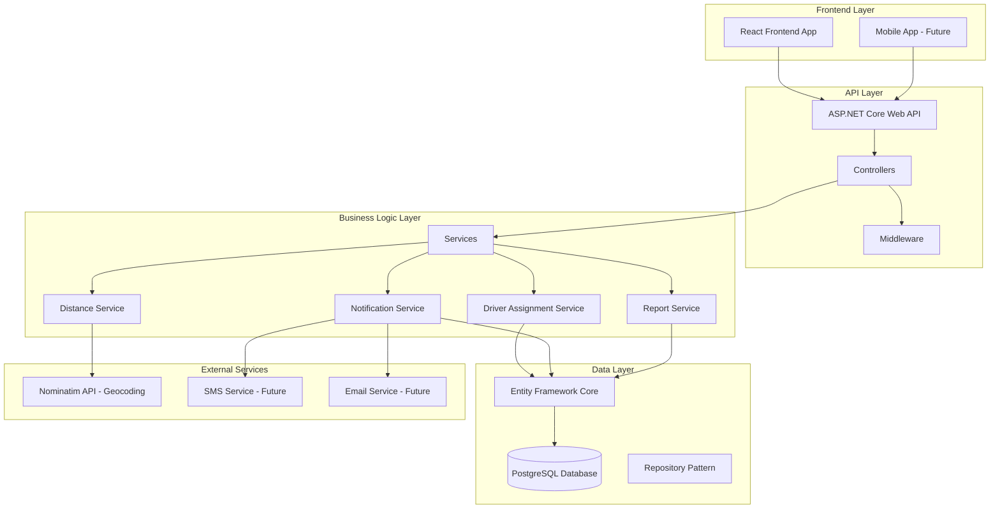

---

## User Journey Flows

### 1. Customer Journey - Creating a Shipment

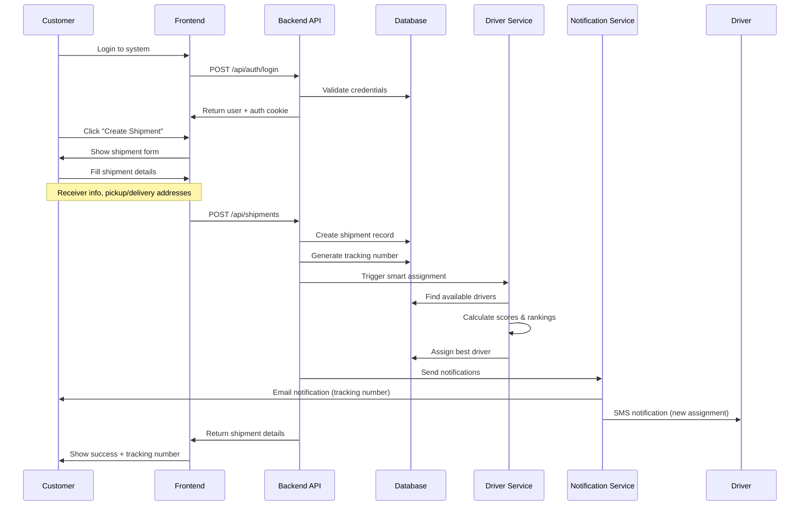

### 2. Driver Journey - Accepting and Completing Shipment

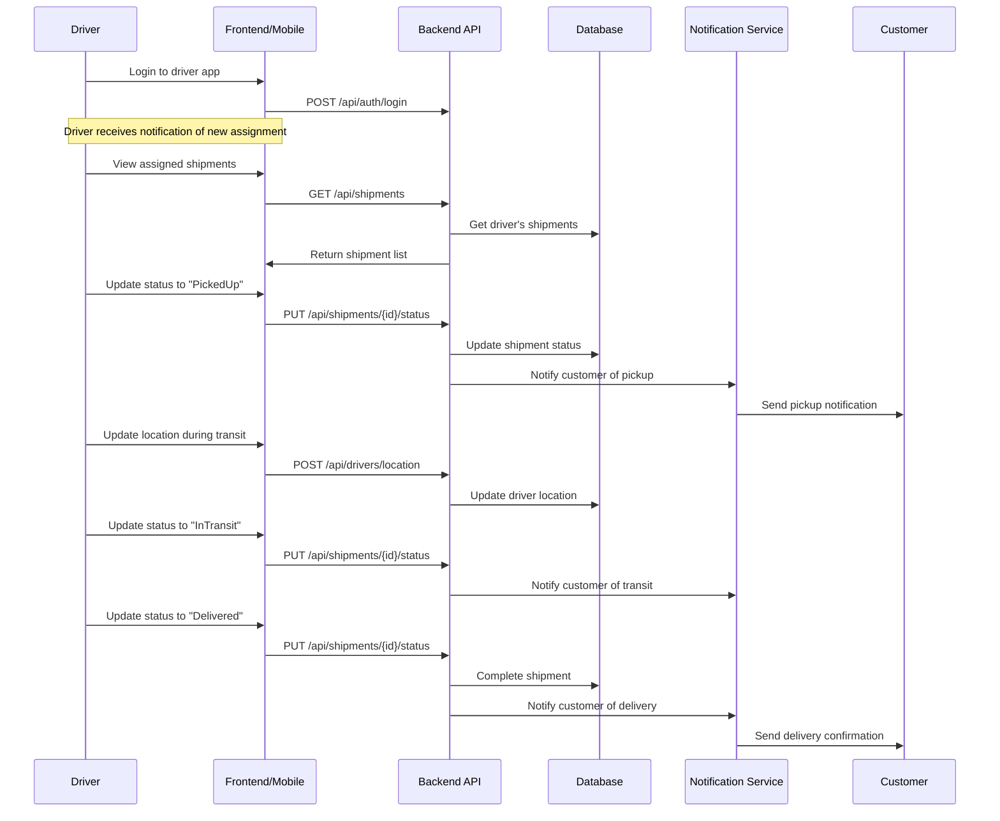

### 3. Admin Journey - System Management

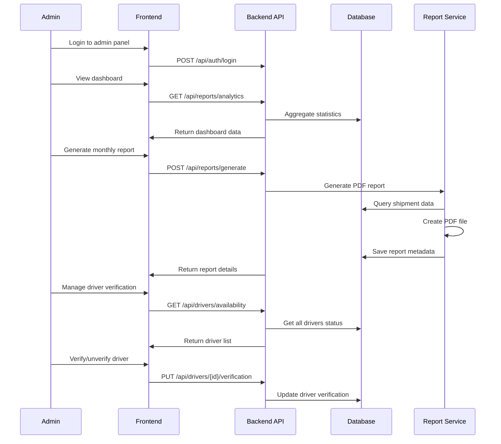

---

## Smart Driver Assignment Algorithm

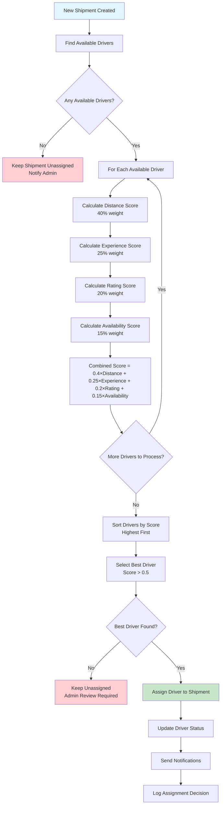

### Driver Scoring Algorithm Details

```mermaid
graph TD
    subgraph "Distance Score (40%)"
        A1[Calculate Distance<br/>Driver → Pickup Location]
        A2{Distance < 5km?}
        A3[Score = 1.0]
        A4{Distance < 15km?}
        A5[Score = 0.8]
        A6{Distance < 30km?}
        A7[Score = 0.5]
        A8[Score = 0.1]
        
        A1 --> A2
        A2 -->|Yes| A3
        A2 -->|No| A4
        A4 -->|Yes| A5
        A4 -->|No| A6
        A6 -->|Yes| A7
        A6 -->|No| A8
    end
    
    subgraph "Experience Score (25%)"
        B1[Get Completed Shipments]
        B2{Shipments > 100?}
        B3[Score = 1.0]
        B4{Shipments > 50?}
        B5[Score = 0.8]
        B6{Shipments > 20?}
        B7[Score = 0.6]
        B8{Shipments > 5?}
        B9[Score = 0.4]
        B10[Score = 0.2]
        
        B1 --> B2
        B2 -->|Yes| B3
        B2 -->|No| B4
        B4 -->|Yes| B5
        B4 -->|No| B6
        B6 -->|Yes| B7
        B6 -->|No| B8
        B8 -->|Yes| B9
        B8 -->|No| B10
    end
    
    subgraph "Rating Score (20%)"
        C1[Get Average Rating]
        C2{Rating ≥ 4.5?}
        C3[Score = 1.0]
        C4{Rating ≥ 4.0?}
        C5[Score = 0.8]
        C6{Rating ≥ 3.5?}
        C7[Score = 0.6]
        C8{Rating ≥ 3.0?}
        C9[Score = 0.4]
        C10[Score = 0.2]
        
        C1 --> C2
        C2 -->|Yes| C3
        C2 -->|No| C4
        C4 -->|Yes| C5
        C4 -->|No| C6
        C6 -->|Yes| C7
        C6 -->|No| C8
        C8 -->|Yes| C9
        C8 -->|No| C10
    end
    
    subgraph "Availability Score (15%)"
        D1[Check Current Load]
        D2{No Active Shipments?}
        D3[Score = 1.0]
        D4{Less than 50% capacity?}
        D5[Score = 0.8]
        D6{Less than 80% capacity?}
        D7[Score = 0.5]
        D8[Score = 0.2]
        
        D1 --> D2
        D2 -->|Yes| D3
        D2 -->|No| D4
        D4 -->|Yes| D5
        D4 -->|No| D6
        D6 -->|Yes| D7
        D6 -->|No| D8
    end
```

---

## Shipment Lifecycle Flow

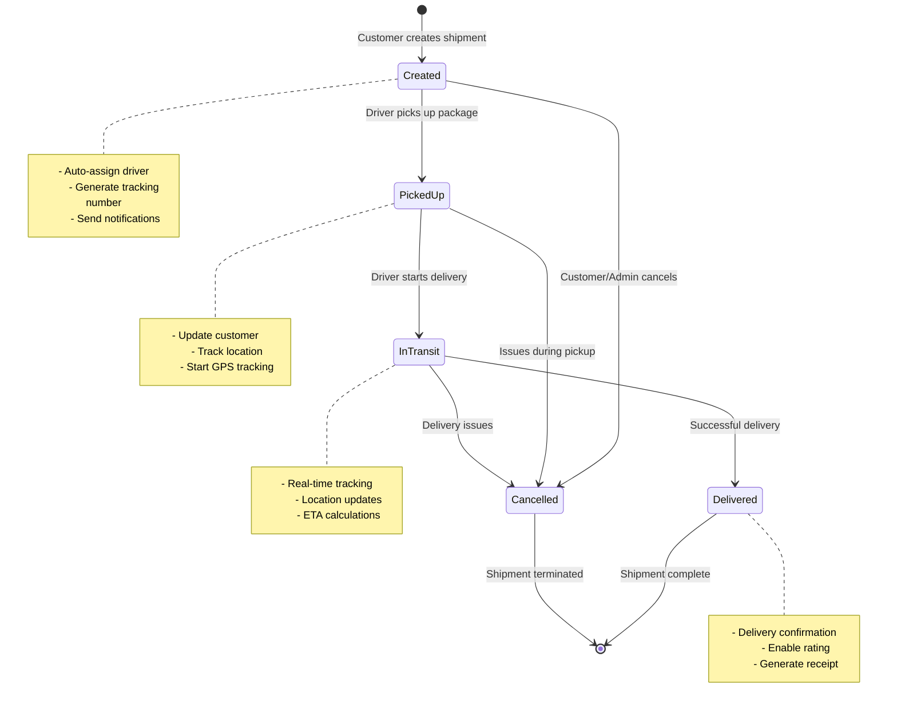

---

## Authentication & Authorization Flow

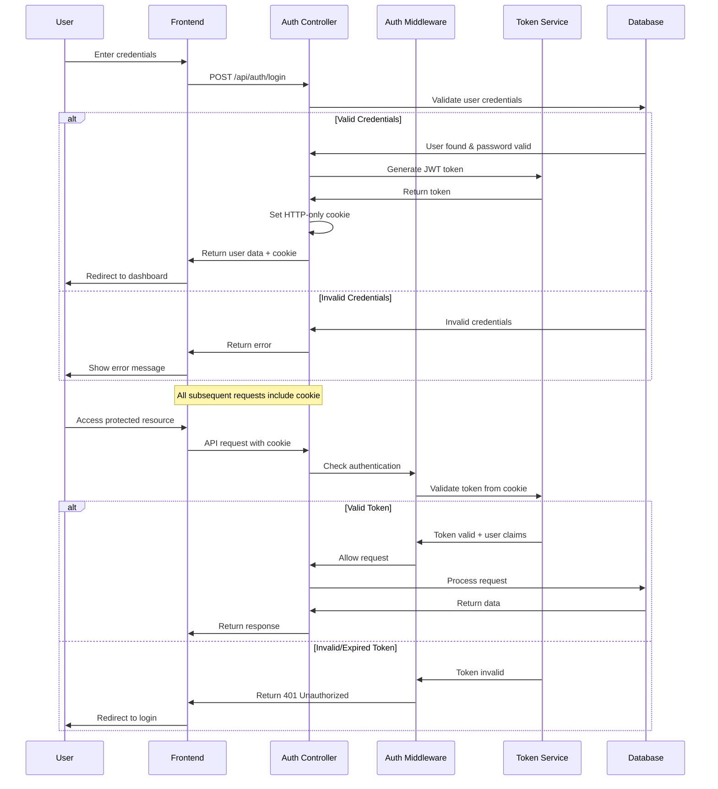

---

## API Request Flow

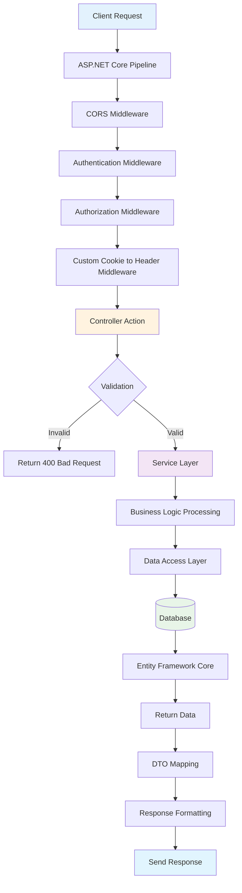

---

## Database Transaction Flow

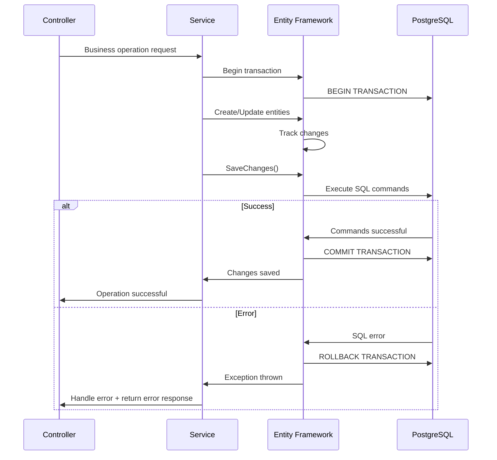

---

## Notification System Flow

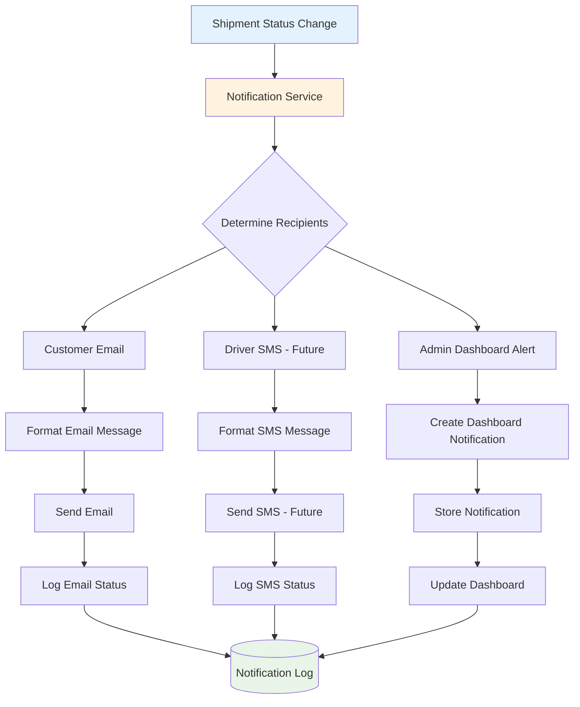

---

## System Architecture

### High-Level Architecture

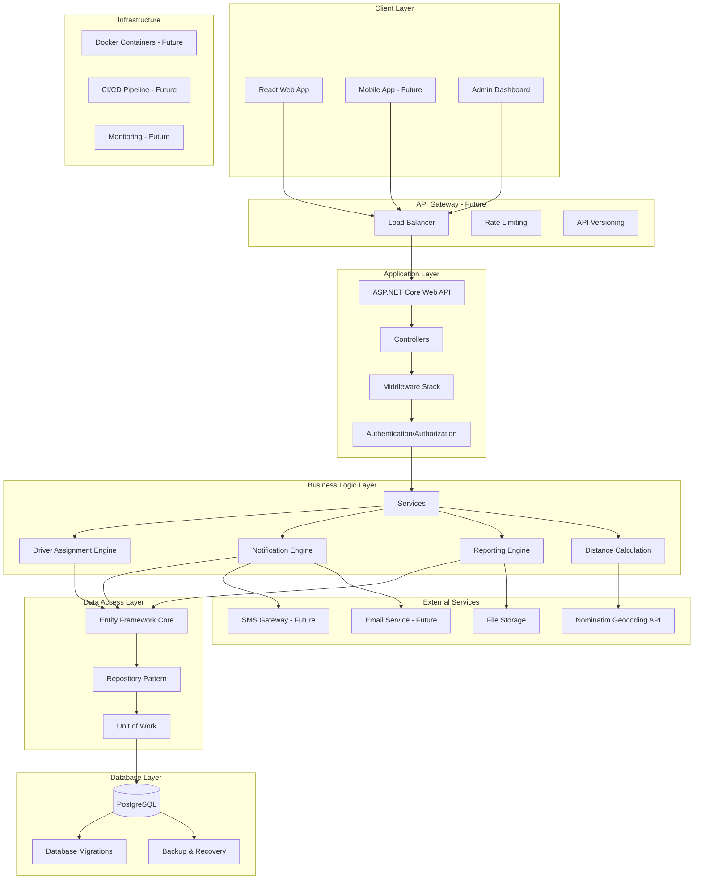

### Database Architecture

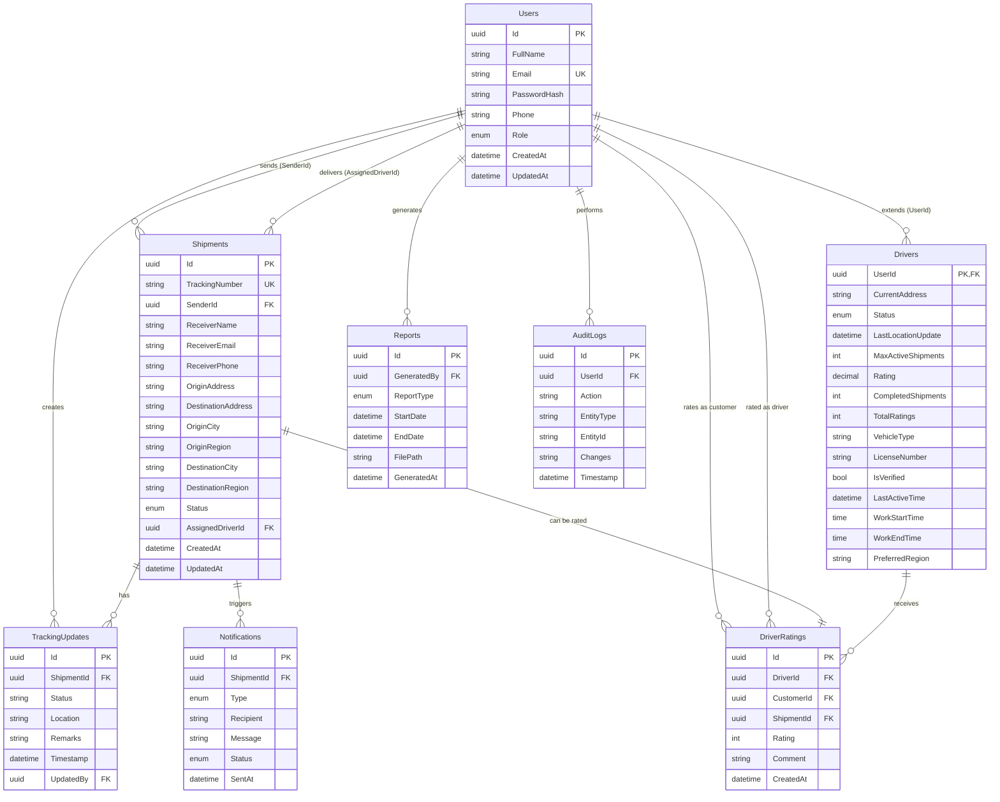

### Technology Stack

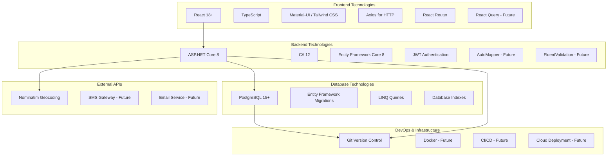

---

## Key System Flows Summary

1. **User Authentication**: Cookie-based authentication with JWT tokens
2. **Shipment Creation**: Customer creates → System auto-assigns driver → Notifications sent
3. **Smart Assignment**: Multi-factor algorithm considers distance, experience, rating, availability
4. **Status Tracking**: Real-time updates throughout shipment lifecycle
5. **Driver Management**: Profile management, location updates, status changes
6. **Analytics & Reporting**: Comprehensive dashboard with PDF report generation
7. **Data Persistence**: PostgreSQL with Entity Framework Core ORM
8. **External Integration**: Nominatim API for geocoding and distance calculations

This architecture ensures scalability, maintainability, and a smooth user experience across all system components.