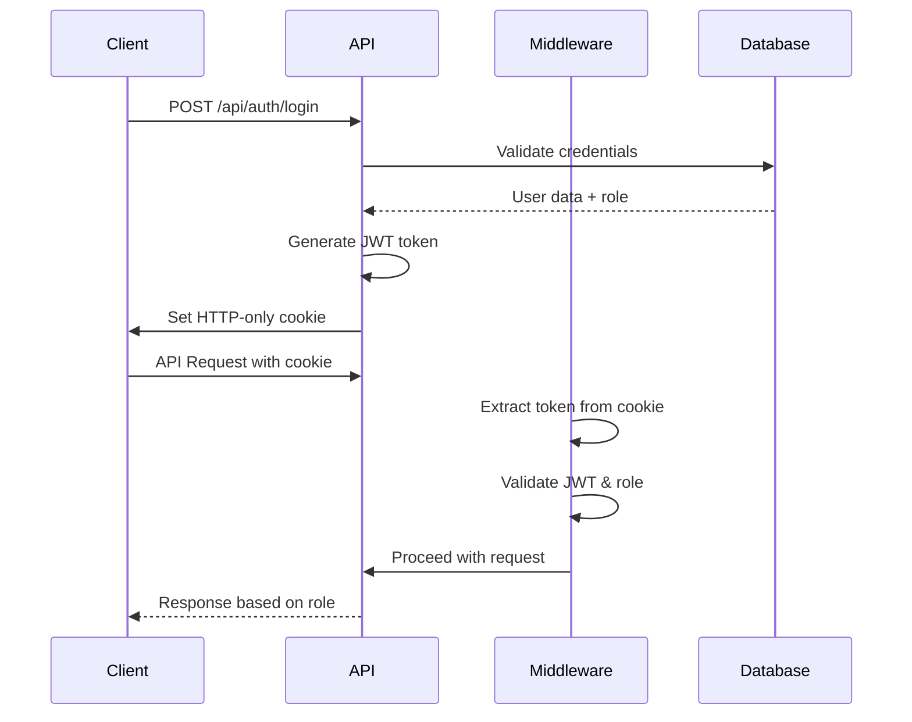
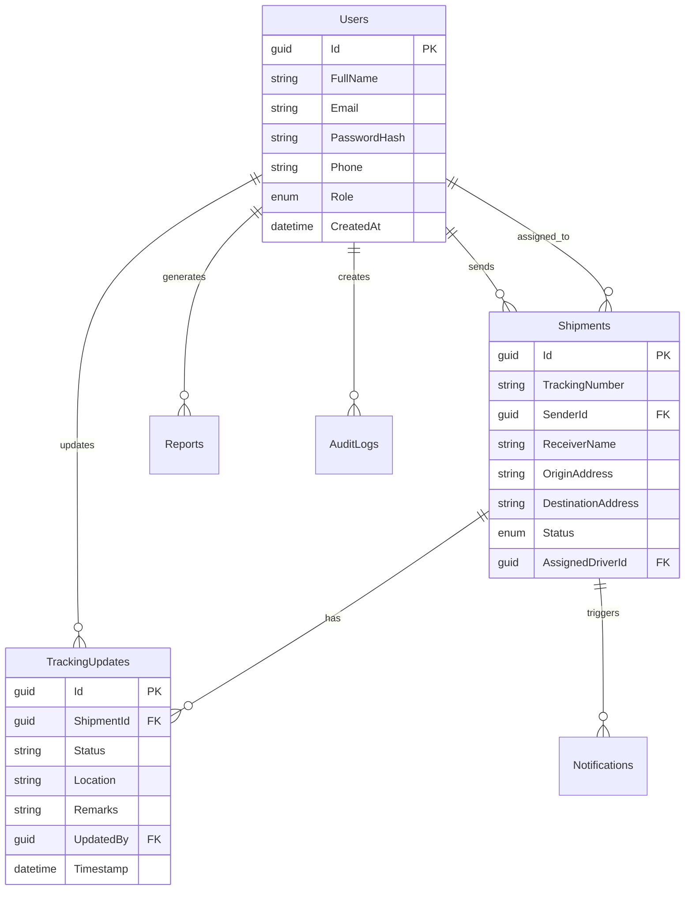
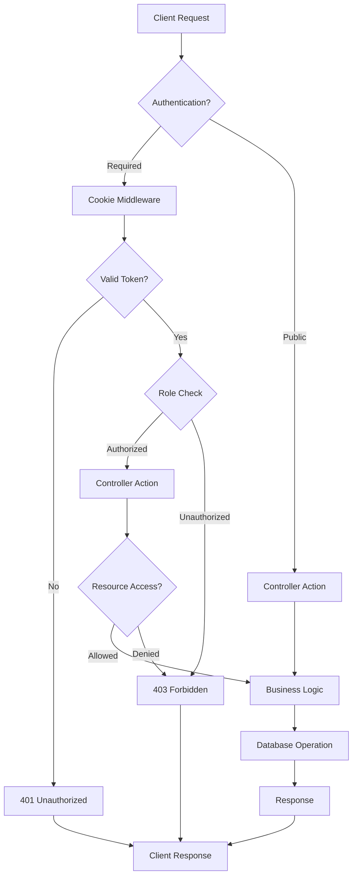

# 🚛 Logistic Shipment Tracker - Backend API

> A comprehensive shipment tracking system built with ASP.NET Core 8.0, featuring role-based access control, real-time tracking, and analytics dashboard.

[](https://dotnet.microsoft.com/)
[](https://postgresql.org/)
[](LICENSE)

## 🌟 Features

- **🔐 Role-Based Access Control**: Admin, Driver, and Customer roles with specific permissions
- **📦 Shipment Management**: Create, track, and manage shipments with real-time status updates
- **🚚 Driver Operations**: Driver assignment and status updates with address-based locations
- **📊 Analytics Dashboard**: Comprehensive reporting and analytics for administrators
- **📱 Real-time Tracking**: Public shipment tracking with detailed status history
- **🔔 Smart Notifications**: Automated email/SMS notifications for status changes
- **🧠 Smart Driver Assignment**: AI-powered driver recommendation and assignment system
- **📋 PDF Reports**: Generate and download detailed shipment reports
- **🍪 Cookie Authentication**: Secure HTTP-only cookie-based authentication
- **📚 API Documentation**: Comprehensive API guide with examples

## 🎭 User Roles & Responsibilities

### 👑 **Admin Role**
**Full System Administrator with Complete Access**

#### Core Responsibilities:
- 🏢 **System Management**: Complete oversight of the logistics platform
- 👥 **User Management**: Create, modify, and manage all user accounts
- 🚛 **Fleet Management**: Assign drivers to shipments and optimize routes
- 📊 **Business Intelligence**: Access comprehensive analytics and generate reports
- 🔧 **System Maintenance**: Monitor system health and audit logs

#### Specific Capabilities:
- **User Operations**: View, create, update, and delete user accounts (except other admins)
- **Shipment Oversight**: Access to all shipments across the platform
- **Driver Assignment**: Assign and reassign drivers to optimize delivery efficiency
- **Reporting**: Generate detailed PDF reports with custom date ranges
- **Analytics**: View dashboard metrics, monthly statistics, and KPIs
- **Audit Trail**: Access to system audit logs and user activities

---

### 🚛 **Driver Role**
**Delivery Professional with Operational Access**

#### Core Responsibilities:
- 📦 **Shipment Execution**: Handle assigned deliveries efficiently
- 📍 **Real-time Updates**: Provide location and status updates during transit
- 🤝 **Customer Communication**: Ensure smooth delivery experience

#### Specific Capabilities:
- **Assigned Shipments**: View only shipments assigned to them
- **Status Updates**: Update shipment status (PickedUp, InTransit, Delivered)
- **Location Tracking**: Add GPS coordinates and location remarks
- **Profile Management**: Update personal profile information
- **Delivery Confirmation**: Mark shipments as delivered with proof

---

### 👤 **Customer Role**
**End User with Self-Service Access**

#### Core Responsibilities:
- 📦 **Shipment Creation**: Create new shipment requests
- 🔍 **Tracking**: Monitor their shipment progress in real-time
- 📧 **Communication**: Receive notifications about shipment updates
- 👤 **Account Management**: Maintain their profile information

#### Specific Capabilities:
- **Personal Shipments**: View and track only their own shipments
- **Shipment Creation**: Create new delivery requests with recipient details
- **Profile Updates**: Modify personal information and contact details
- **Tracking Access**: Monitor shipment progress and delivery status

---

## 🔐 API Access Control Matrix

### **🌐 Public APIs** (No Authentication Required)

| Endpoint | Method | Description | Access Level |
|----------|---------|-------------|-------------|
| `/api/auth/register` | POST | User registration | 🌍 Public |
| `/api/auth/login` | POST | User authentication | 🌍 Public |
| `/api/auth/logout` | POST | User logout | 🌍 Public |
| `/api/shipments/track/{trackingNumber}` | GET | Public shipment tracking | 🌍 Public |

### **👑 Admin-Only APIs**

| Endpoint | Method | Description | Restrictions |
|----------|---------|-------------|-------------|
| `/api/users` | GET | List all users with filtering | ✅ Admin Only |
| `/api/users/{id}` | DELETE | Delete user accounts | ✅ Admin Only (Cannot delete other admins) |
| `/api/users/drivers` | GET | List all drivers | ✅ Admin Only |
| `/api/shipments/{id}/assign-driver` | PUT | Assign driver to shipment | ✅ Admin Only |
| `/api/shipments/{id}/driver-recommendations` | GET | Get smart driver recommendations | ✅ Admin Only |
| `/api/shipments/{id}/smart-assign` | POST | Smart driver assignment | ✅ Admin Only |
| `/api/shipments/available-drivers` | GET | View driver availability | ✅ Admin Only |
| `/api/reports/generate` | POST | Generate PDF reports | ✅ Admin Only |
| `/api/reports/{id}/download` | GET | Download report files | ✅ Admin Only |
| `/api/reports` | GET | List all generated reports | ✅ Admin Only |
| `/api/reports/analytics` | GET | Dashboard analytics | ✅ Admin Only |

### **🚛 Driver-Specific APIs**

| Endpoint | Method | Description | Access Control |
|----------|---------|-------------|---------------|
| `/api/shipments` | GET | View shipments | 🔒 Only assigned shipments |
| `/api/shipments/{id}` | GET | Get shipment details | 🔒 Only if assigned to shipment |
| `/api/shipments/{id}/status` | PUT | Update shipment status | 🔒 Only assigned shipments |

### **👤 Customer-Specific APIs**

| Endpoint | Method | Description | Access Control |
|----------|---------|-------------|---------------|
| `/api/shipments` | GET | View shipments | 🔒 Only own shipments |
| `/api/shipments/{id}` | GET | Get shipment details | 🔒 Only own shipments |
| `/api/shipments` | POST | Create new shipment | ✅ Customer + Admin |

### **🔄 Shared Authenticated APIs**

| Endpoint | Method | Description | Access Control |
|----------|---------|-------------|---------------|
| `/api/auth/me` | GET | Get current user info | 🔐 All authenticated users |
| `/api/users/{id}` | GET | Get user profile | 🔒 Own profile or Admin |
| `/api/users/{id}` | PUT | Update user profile | 🔒 Own profile or Admin |

---

## 🛡️ Security & Access Control

### **Authentication Flow**


### **Authorization Levels**

#### 🔴 **Strict Access Control**
- **Admin APIs**: Require `[Authorize(Roles = "Admin")]`
- **Driver APIs**: Require `[Authorize(Roles = "Driver")]` + ownership validation
- **Customer APIs**: Require `[Authorize(Roles = "Admin,Customer")]` + ownership validation

#### 🟡 **Resource Ownership Validation**
```csharp
// Example: Driver can only update assigned shipments
if (shipment.AssignedDriverId != currentUserId)
{
    return Forbid(); // 403 Forbidden
}

// Example: Customer can only view own shipments
query = query.Where(s => s.SenderId == currentUserId);
```

#### 🟢 **Role-Based Filtering**
```csharp
// Shipments filtered by user role
query = currentUserRole switch
{
    "Admin" => query, // See all shipments
    "Driver" => query.Where(s => s.AssignedDriverId == currentUserId),
    "Customer" => query.Where(s => s.SenderId == currentUserId),
    _ => query.Where(s => false) // No access
};
```

---

## 📊 Role Permissions Summary

| Feature | Admin | Driver | Customer | Public |
|---------|-------|--------|----------|--------|
| **User Management** | ✅ Full Control | ❌ | ❌ | ❌ |
| **View All Shipments** | ✅ | ❌ | ❌ | ❌ |
| **View Own/Assigned Shipments** | ✅ | ✅ | ✅ | ❌ |
| **Create Shipments** | ✅ | ❌ | ✅ | ❌ |
| **Assign Drivers** | ✅ | ❌ | ❌ | ❌ |
| **Smart Driver Assignment** | ✅ | ❌ | ❌ | ❌ |
| **Driver Recommendations** | ✅ | ❌ | ❌ | ❌ |
| **Update Shipment Status** | ✅ | ✅* | ❌ | ❌ |
| **Generate Reports** | ✅ | ❌ | ❌ | ❌ |
| **View Analytics** | ✅ | ❌ | ❌ | ❌ |
| **Track by Number** | ✅ | ✅ | ✅ | ✅ |
| **Profile Management** | ✅ All | ✅ Own | ✅ Own | ❌ |

*\* Only for assigned shipments*

## 🚀 Quick Start Guide

### Prerequisites
- **.NET 8.0 SDK** - [Download here](https://dotnet.microsoft.com/download/dotnet/8.0)
- **PostgreSQL 12+** - [Download here](https://www.postgresql.org/download/)
- **SendGrid Account** (Optional) - For email notifications

### 1. 📥 Clone and Setup
```bash
git clone https://github.com/Amarnath-18/demoProject.git
cd demoProject/demoProject
dotnet restore
```

### 2. 🗄️ Database Configuration
1. Create PostgreSQL database named `LogisticTracker`
2. Update connection string in `appsettings.json`:

```json
{
  "ConnectionStrings": {
    "DefaultConnection": "Host=localhost;Port=5432;Database=LogisticTracker;Username=your_username;Password=your_password"
  }
}
```

### 3. ⚙️ Application Configuration
Update the following in `appsettings.json`:

```json
{
  "Jwt": {
    "Key": "your-super-secret-jwt-key-that-is-at-least-32-characters-long",
    "Issuer": "LogisticTracker",
    "Audience": "LogisticTrackerUsers"
  },
  "SendGrid": {
    "ApiKey": "your-sendgrid-api-key-here",
    "FromEmail": "noreply@yourdomain.com"
  }
}
```

### 4. 🏃‍♂️ Run the Application
```bash
dotnet run
```

**Access Points:**
- 🌐 **API Base URL**: `http://localhost:5000/api`
- 📚 **Swagger UI**: `http://localhost:5000`
- 🔒 **HTTPS**: `https://localhost:7000`

### 5. 🎯 Test with Sample Data
The application includes a data seeder that creates sample users:

```json
{
  "admin": {
    "email": "admin@logistictracker.com",
    "password": "Admin@123",
    "role": "Admin"
  },
  "driver": {
    "email": "mike.driver@logistictracker.com", 
    "password": "Driver@123",
    "role": "Driver"
  },
  "customer": {
    "email": "john.customer@logistictracker.com",
    "password": "Customer@123", 
    "role": "Customer"
  }
}
```

---

## 📖 API Usage Examples

### 🔐 Authentication Flow
```bash
# Register new user
curl -X POST "http://localhost:5000/api/auth/register" \
  -H "Content-Type: application/json" \
  -d '{
    "fullName": "John Doe",
    "email": "john@example.com",
    "password": "Password@123",
    "role": "Customer"
  }'

# Login (sets HTTP-only cookie)
curl -X POST "http://localhost:5000/api/auth/login" \
  -H "Content-Type: application/json" \
  -d '{
    "email": "john@example.com",
    "password": "Password@123"
  }' \
  -c cookies.txt

# Use authenticated endpoint
curl -X GET "http://localhost:5000/api/auth/me" \
  -b cookies.txt
```

### 📦 Shipment Operations
```bash
# Create shipment (Customer/Admin)
curl -X POST "http://localhost:5000/api/shipments" \
  -H "Content-Type: application/json" \
  -b cookies.txt \
  -d '{
    "receiverName": "Jane Smith",
    "receiverEmail": "jane@example.com",
    "originAddress": "123 Main St, NYC",
    "destinationAddress": "456 Oak Ave, LA",
    "originCity": "New York",
    "originRegion": "NY",
    "destinationCity": "Los Angeles",
    "destinationRegion": "CA"
  }'

# Track shipment (Public)
curl -X GET "http://localhost:5000/api/shipments/track/LST123456"

# Update shipment status (Driver only)
curl -X PUT "http://localhost:5000/api/shipments/{id}/status" \
  -H "Content-Type: application/json" \
  -b cookies.txt \
  -d '{
    "status": "InTransit",
    "location": "Highway Rest Stop, Denver Area",
    "remarks": "Package in transit, on schedule"
  }'
```

### 👑 Admin Operations
```bash
# Get analytics dashboard
curl -X GET "http://localhost:5000/api/reports/analytics" \
  -b cookies.txt

# Get smart driver recommendations
curl -X GET "http://localhost:5000/api/shipments/{id}/driver-recommendations?priority=Balanced" \
  -b cookies.txt

# Smart driver assignment (auto-assign best driver)
curl -X POST "http://localhost:5000/api/shipments/{id}/smart-assign" \
  -H "Content-Type: application/json" \
  -b cookies.txt \
  -d '{
    "useAutoAssignment": true,
    "priority": "Balanced"
  }'

# Manual driver assignment (legacy)
curl -X PUT "http://localhost:5000/api/shipments/{id}/assign-driver" \
  -H "Content-Type: application/json" \
  -b cookies.txt \
  -d '{"driverId": "driver-guid-here"}'

# Generate report
curl -X POST "http://localhost:5000/api/reports/generate" \
  -H "Content-Type: application/json" \
  -b cookies.txt \
  -d '{
    "reportType": "Weekly",
    "startDate": "2024-01-01",
    "endDate": "2024-01-07"
  }'
```

---

## 🏗️ System Architecture

### 📊 Database Schema


### 🔄 Request Flow


## 🛠️ Development Guide

### 📁 Project Structure
```
demoProject/
├── 📁 Controllers/          # API Controllers
│   ├── AuthController.cs    # Authentication endpoints
│   ├── UsersController.cs   # User management
│   ├── ShipmentsController.cs # Shipment operations
│   └── ReportsController.cs # Analytics & reporting
├── 📁 Models/              # Data models
│   ├── User.cs             # User entity
│   ├── Shipment.cs         # Shipment entity
│   ├── TrackingUpdate.cs   # Status updates
│   ├── Notification.cs     # Notification logs
│   ├── Report.cs           # Report metadata
│   └── AuditLog.cs         # Audit trail
├── 📁 DTOs/                # Data Transfer Objects
│   ├── UserDTOs.cs         # User request/response models
│   ├── ShipmentDTOs.cs     # Shipment request/response models
│   └── CommonDTOs.cs       # Shared DTOs
├── 📁 Services/            # Business logic
│   ├── TokenService.cs     # JWT token management
│   ├── NotificationService.cs # Email/SMS notifications
│   ├── ReportService.cs    # PDF report generation
│   └── DataSeeder.cs       # Sample data creation
├── 📁 Data/                # Database context
│   └── ApplicationDbContext.cs
├── 📁 Middleware/          # Custom middleware
│   └── CookieToHeaderMiddleware.cs
└── 📁 Tests/               # Unit tests
    └── CookieAuthenticationTests.cs
```

### 🔧 Adding New Features

#### 1. Create New Entity
```csharp
// Models/YourEntity.cs
public class YourEntity
{
    public Guid Id { get; set; } = Guid.NewGuid();
    // Add your properties
    public DateTime CreatedAt { get; set; } = DateTime.UtcNow;
}
```

#### 2. Update Database Context
```csharp
// Data/ApplicationDbContext.cs
public DbSet<YourEntity> YourEntities { get; set; }
```

#### 3. Create DTOs
```csharp
// DTOs/YourEntityDTOs.cs
public class CreateYourEntityRequest
{
    // Request properties
}

public class YourEntityResponse
{
    // Response properties
}
```

#### 4. Create Controller
```csharp
// Controllers/YourEntityController.cs
[ApiController]
[Route("api/[controller]")]
[Authorize] // Add role-specific authorization as needed
public class YourEntityController : ControllerBase
{
    // Implement CRUD operations
}
```

### 🧪 Testing

#### Unit Tests
```bash
# Run all tests
dotnet test

# Run specific test
dotnet test --filter "TestName"

# Run with coverage
dotnet test --collect:"XPlat Code Coverage"
```

#### API Testing with Swagger
1. Navigate to `http://localhost:5000`
2. Use the interactive Swagger UI
3. Test endpoints with different user roles

#### Manual Testing
Use the provided sample data or create test users:

```bash
# Test as Admin
curl -X POST "http://localhost:5000/api/auth/login" \
  -d '{"email":"admin@logistictracker.com","password":"Admin@123"}'

# Test as Driver  
curl -X POST "http://localhost:5000/api/auth/login" \
  -d '{"email":"mike.driver@logistictracker.com","password":"Driver@123"}'

# Test as Customer
curl -X POST "http://localhost:5000/api/auth/login" \
  -d '{"email":"john.customer@logistictracker.com","password":"Customer@123"}'
```

---

## 🚀 Deployment

### 🐳 Docker Deployment
```dockerfile
# Dockerfile
FROM mcr.microsoft.com/dotnet/aspnet:8.0 AS base
WORKDIR /app
EXPOSE 80

FROM mcr.microsoft.com/dotnet/sdk:8.0 AS build
WORKDIR /src
COPY ["demoProject.csproj", "."]
RUN dotnet restore
COPY . .
RUN dotnet publish -c Release -o /app

FROM base AS final
WORKDIR /app
COPY --from=build /app .
ENTRYPOINT ["dotnet", "demoProject.dll"]
```

```yaml
# docker-compose.yml
version: '3.8'
services:
  api:
    build: .
    ports:
      - "5000:80"
    environment:
      - ConnectionStrings__DefaultConnection=Host=db;Database=LogisticTracker;Username=postgres;Password=password
    depends_on:
      - db
      
  db:
    image: postgres:15
    environment:
      POSTGRES_DB: LogisticTracker
      POSTGRES_USER: postgres
      POSTGRES_PASSWORD: password
    volumes:
      - postgres_data:/var/lib/postgresql/data
    ports:
      - "5432:5432"

volumes:
  postgres_data:
```

### ☁️ Cloud Deployment

#### Azure App Service
```bash
# Create resource group
az group create --name LogisticTracker --location "East US"

# Create App Service plan
az appservice plan create --name LogisticTrackerPlan --resource-group LogisticTracker --sku B1

# Create web app
az webapp create --resource-group LogisticTracker --plan LogisticTrackerPlan --name LogisticTrackerAPI

# Deploy from GitHub
az webapp deployment source config --name LogisticTrackerAPI --resource-group LogisticTracker \
  --repo-url https://github.com/Amarnath-18/demoProject --branch master
```

#### Environment Variables for Production
```bash
# Set connection string
az webapp config appsettings set --resource-group LogisticTracker --name LogisticTrackerAPI \
  --settings ConnectionStrings__DefaultConnection="your-production-connection-string"

# Set JWT settings
az webapp config appsettings set --resource-group LogisticTracker --name LogisticTrackerAPI \
  --settings Jwt__Key="your-production-jwt-key"

# Set SendGrid settings
az webapp config appsettings set --resource-group LogisticTracker --name LogisticTrackerAPI \
  --settings SendGrid__ApiKey="your-sendgrid-api-key"
```

---

## 🔧 Troubleshooting

### Common Issues & Solutions

#### 🔴 **Authentication Issues**
```bash
# Problem: 401 Unauthorized
# Solution: Check if cookie is set correctly
curl -v -X GET "http://localhost:5000/api/auth/me" -b cookies.txt

# Problem: JWT token invalid
# Solution: Verify JWT settings in appsettings.json
```

#### 🔴 **Database Connection Issues**
```bash
# Problem: Connection refused
# Solution: Verify PostgreSQL is running
sudo systemctl status postgresql

# Problem: Login failed
# Solution: Check connection string and credentials
psql -h localhost -U your_username -d LogisticTracker
```

#### 🔴 **Role Permission Issues**
```bash
# Problem: 403 Forbidden
# Solution: Check user role and endpoint authorization
# Verify role claim in JWT token
```

#### 🔴 **CORS Issues**
```csharp
// Problem: CORS policy violation
// Solution: Update allowed origins in Program.cs
builder.Services.AddCors(options =>
{
    options.AddPolicy("AllowFrontend", policy =>
    {
        policy.WithOrigins("http://localhost:3000", "https://yourfrontend.com")
              .AllowCredentials()
              .AllowAnyMethod()
              .AllowAnyHeader();
    });
});
```

### 📋 Health Checks
The API includes health check endpoints:

```bash
# Check API health
curl -X GET "http://localhost:5000/health"

# Check database connectivity
curl -X GET "http://localhost:5000/health/db"
```

### 📊 Monitoring & Logging

#### Application Insights (Azure)
```csharp
// Add to Program.cs
builder.Services.AddApplicationInsightsTelemetry();
```

#### Custom Logging
```csharp
// In controllers
private readonly ILogger<YourController> _logger;

public YourController(ILogger<YourController> logger)
{
    _logger = logger;
}

// Log activities
_logger.LogInformation("User {UserId} created shipment {ShipmentId}", userId, shipmentId);
_logger.LogWarning("Failed login attempt for {Email}", request.Email);
_logger.LogError(ex, "Error processing shipment {ShipmentId}", shipmentId);
```

---

## 🌟 Future Enhancements

### 🚀 **Planned Features**
- [ ] **Real-time Notifications**: SignalR integration for live updates
- [ ] **Mobile API**: Optimized endpoints for mobile applications
- [ ] **Route Optimization**: AI-powered delivery route planning
- [ ] **Geofencing**: Automatic status updates based on location
- [ ] **Multi-tenant Support**: Support for multiple logistics companies
- [ ] **Advanced Analytics**: Machine learning insights and predictions
- [ ] **API Rate Limiting**: Request throttling and abuse prevention
- [ ] **Webhook Support**: External system integration capabilities

### 🔧 **Technical Improvements**
- [ ] **Redis Caching**: Performance optimization with distributed caching
- [ ] **Message Queues**: Asynchronous processing with RabbitMQ/Azure Service Bus
- [ ] **Microservices**: Break down into smaller, focused services
- [ ] **GraphQL**: Alternative query language for flexible data fetching
- [ ] **OpenAPI 3.0**: Enhanced API documentation and client generation

---

## 📚 Additional Resources

### 📖 **Documentation**
- [API Examples](API_EXAMPLES.md) - Detailed API usage examples
- [Frontend Integration Guide](FRONTEND_API_GUIDE.md) - Complete frontend integration guide
- [Smart Driver Assignment Guide](DRIVER_ASSIGNMENT_GUIDE.md) - Comprehensive driver assignment documentation
- [Driver Assignment Quick Start](DRIVER_ASSIGNMENT_README.md) - Quick start guide for driver assignment
- [Cookie Authentication Guide](COOKIE_AUTH_GUIDE.md) - Cookie-based auth implementation

### 🔗 **Related Technologies**
- [ASP.NET Core 8.0 Documentation](https://docs.microsoft.com/en-us/aspnet/core/)
- [Entity Framework Core](https://docs.microsoft.com/en-us/ef/core/)
- [PostgreSQL Documentation](https://www.postgresql.org/docs/)
- [SendGrid API](https://docs.sendgrid.com/)
- [QuestPDF Documentation](https://www.questpdf.com/)

### 🤝 **Contributing**
1. Fork the repository
2. Create a feature branch (`git checkout -b feature/AmazingFeature`)
3. Commit your changes (`git commit -m 'Add some AmazingFeature'`)
4. Push to the branch (`git push origin feature/AmazingFeature`)
5. Open a Pull Request

### 📞 **Support**
- **Issues**: [GitHub Issues](https://github.com/Amarnath-18/demoProject/issues)
- **Discussions**: [GitHub Discussions](https://github.com/Amarnath-18/demoProject/discussions)
- **Email**: support@logistictracker.com

---

## 📄 License

This project is licensed under the MIT License - see the [LICENSE](LICENSE) file for details.

---

<div align="center">

**Built with ❤️ using ASP.NET Core 8.0**

[](https://github.com/Amarnath-18/demoProject/stargazers)
[](https://github.com/Amarnath-18/demoProject/network)
[](https://github.com/Amarnath-18/demoProject/issues)

</div>